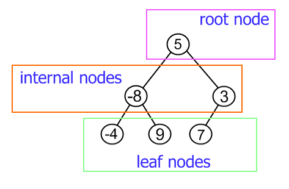
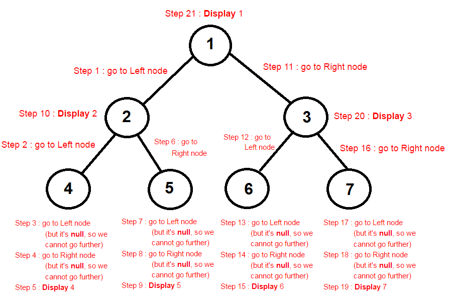

# Tree

## WHAT is a Tree?

A tree data structure is a hierarchical structure that is used to represent and organize data in a way that is easy to navigate and search. It is a collection of nodes that are connected by edges and has a hierarchical relationship between the nodes.

The topmost node of the tree is called the root, and the nodes below it are called the child nodes. Each node can have multiple child nodes, and these child nodes can also have their own child nodes, forming a recursive structure.

## WHY Trees

Trees are used in data structures for a variety of reasons.  

1. One reason is that trees can be easily traversed in a particular order. This is helpful when searching for data, as it allows the algorithm to narrow down the search space quickly.  

2. Another reason is that trees can be used to store data hierarchically. This is common in applications such as file systems, where files and directories are organized in a tree-like structure.  

3. Finally, trees can be used to efficiently implement certain types of algorithms, such as those that require sorting or searching. Trees are a versatile data structure with many uses in computer science.

## How to implement Trees

### Note :: This code for Binary Trees

```java
public class Tree { 
    static class Node {    
    int value; 
        Node left, right; 
          
        Node(int value){ 
            this.value = value; 
            left = null; 
            right = null; 
        } 
    
    // if we need to create function to add new node to Tree
        public void insert(Node node, int value) {
        if (value < node.value) {
             if (node.left != null) {
                 insert(node.left, value); } 
            else {
                System.out.println(" Inserted " + value + " to left of " + node.value);
                node.left = new Node(value); 
                } 
            } 
        else if (value > node.value) {
          if (node.right != null) {
            insert(node.right, value);
          } else {
            System.out.println("  Inserted " + value + " to right of " + node.value);
            node.right = new Node(value);
          }
        }
      }
    
    // and we can add any function we want
    
    }
    
    // example
    public static void main(String args[]) 
    { 
                Tree tree = new Tree();
                Node root = new Node(5);
                System.out.println("Building tree with root value " + root.value);

                tree.insert(root, 2);
                tree.insert(root, 4);
                tree.insert(root, 8);
                tree.insert(root, 6);

                // The output will be : 

                /*
                Building tree with root value 5
                Inserted 2 to left of 5
                Inserted 4 to right of 2
                Inserted 8 to right of 5
                Inserted 6 to left of 8
                */
              }
}

```

## vocabulary/definition list

- Node - A Tree node is a component which may contain its own values, and references to other nodes
- Root - The root is the node at the beginning of the tree
- K - A number that specifies the maximum number of children any node may have in a k-ary tree. In a binary tree, k = 2.
- Left - A reference to one child node, in a binary tree
- Right - A reference to the other child node, in a binary tree
- Edge - The edge in a tree is the link between a parent and child node
- Leaf - A leaf is a node that does not have any children
- Height - The height of a tree is the number of edges from the root to the furthest leaf

## Quiz

1 ) The number of edges from the root to the node is called ...... of the tree.

Height

**Depth**

Length

Width

2 ) What is a full binary tree?

**Each node has exactly zero or two children**

Each node has exactly two children

All the leaves are at the same level

Each node has exactly one or two children

3 ) What is the name of the initial node of a tree data structure?

**Root**

Leave

Branch

Bunch

## Cheat Sheet

- A tree data structure is a collection of nodes connected by edges, where each node has zero or more child nodes

- The top node in a tree is called the root node, and the nodes that have at least one child node are called internal nodes, while the nodes that have no children are called leaf nodes

- A binary tree is a type of tree data structure where each node has at most two child nodes

- A tree data structure can be represented in many ways, such as in an array or a linked list, but the most common representation is a graphical one, where each node is represented as a circle and each edge is represented as a line connecting two circles

## Anthropomorphize the Concepts

A conversation between Root and Leaf:

Root: Hi Leaf, how are you doing?

Leaf: I'm good, thanks. Just hanging out here at the end of the branch

Root: Yeah, I remember when I was a leaf like you. But now I'm the head honcho of this tree

Leaf: Wow, that's impressive. What do you do all day?

Root: Well, I'm responsible for holding this whole tree together. I'm the one that all the other nodes branch out from

Leaf: That sounds like a lot of responsibility

Root: It is, but it's also very rewarding. I get to see this tree grow and flourish, and I know that I'm a big part of that

Leaf: I wish I could be more like you

## Some Tree diagram



