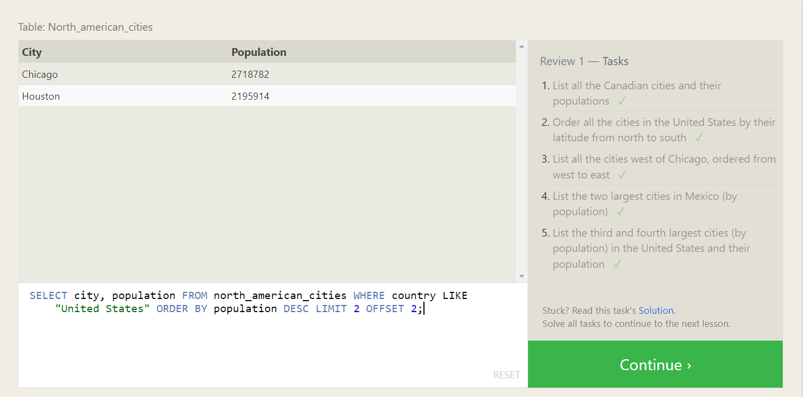
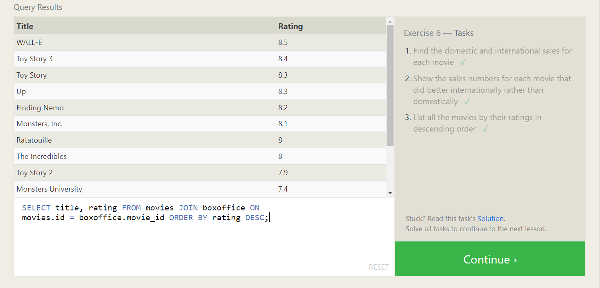
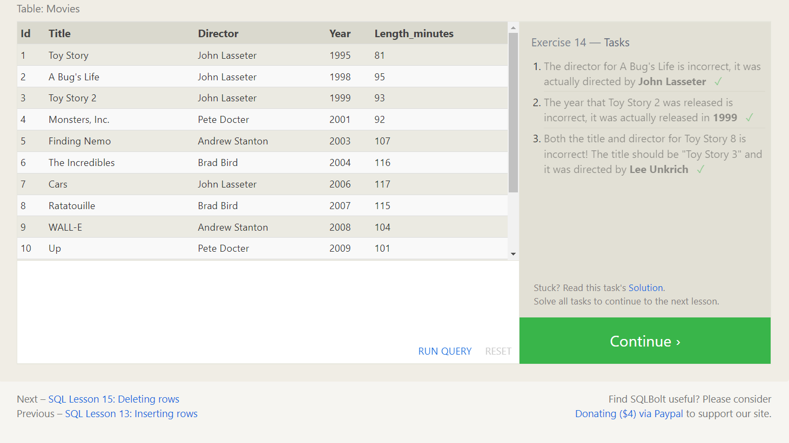

# SQL

### SQL stand for Structured Query Language and it is a language designed to allow both technical and non-technical users query, manipulate, and transform data from a relational database

* SQL databases provide safe and scalable storage for millions of websites and mobile applications.

* relational database represents a collection of related (two-dimensional) tables. Each of the tables are similar to an Excel spreadsheet, with a fixed number of named columns (the attributes or properties of the table) and any number of rows of data

1. we need to write ``` SELECT ``` statements To retrieve data from a SQL database

```
SELECT column, another_column, …
FROM mytable;
```

### Select query for all columns :

```  
SELECT * FROM mytable; 
```

2. we need to use a ``WHERE`` clause in the query to filter certain results

* full-text search is best left to dedicated libraries like `` Apache Lucene `` or `` Sphinx ``. These libraries are designed specifically to do full text search, and as a result are more efficient and can support a wider variety of search features including internationalization and advanced queries

3. the ``DISTINCT`` keyword. which SQL provides a convenient way to discard rows that have a duplicate column and it will blindly remove duplicate rows, value by this order

* SQL provides a way to sort your results by a given column in ascending or descending order using the ORDER BY clause

* The LIMIT will reduce the number of rows to return, and the optional OFFSET will specify where to begin counting the number rows from

```SELECT column, another_column, …
FROM mytable
WHERE condition(s)
ORDER BY column ASC/DESC
LIMIT num_limit OFFSET num_offset;
```

## Inserting rows

* we need to use an ``INSERT`` statement

## Updating rows

* using an ``UPDATE`` statement. Similar to the ``INSERT`` statement

## Deleting rows

* use a ``DELETE`` statement

## Creating tables

* using the ``CREATE TABLE`` statement

## Altering tables

* ``ALTER TABLE`` statement to add, remove, or modify columns and table constraints.

## Dropping tables

* ``DROP TABLE`` statement

# SQL Queries Tasks





# Database Management Tasks





