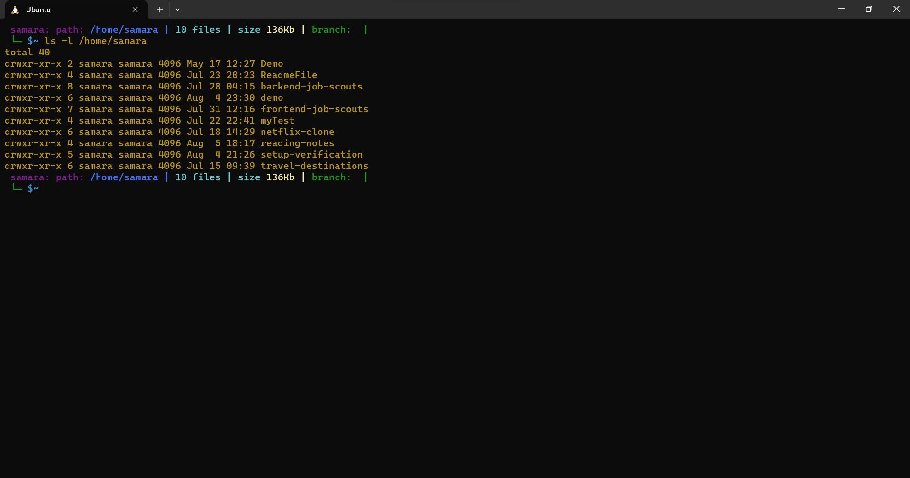
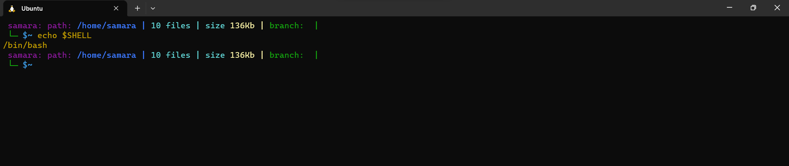
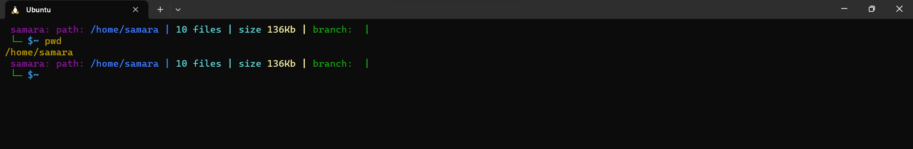
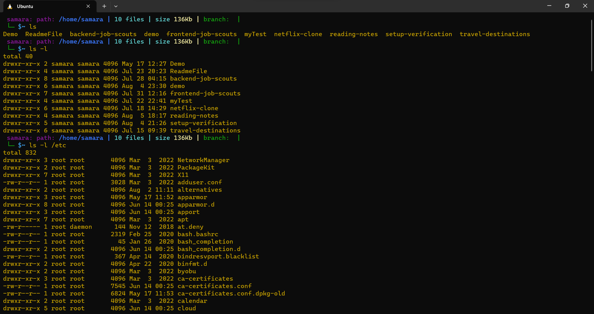
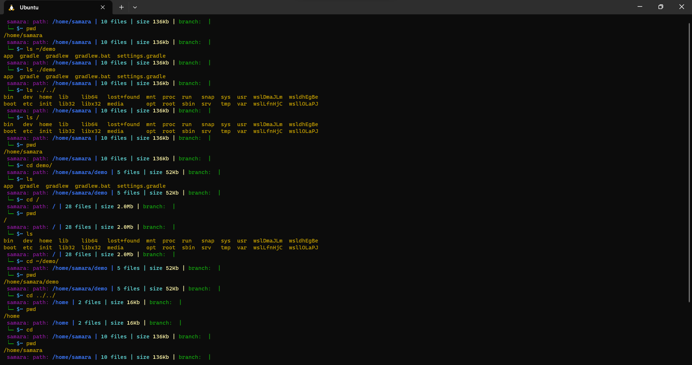
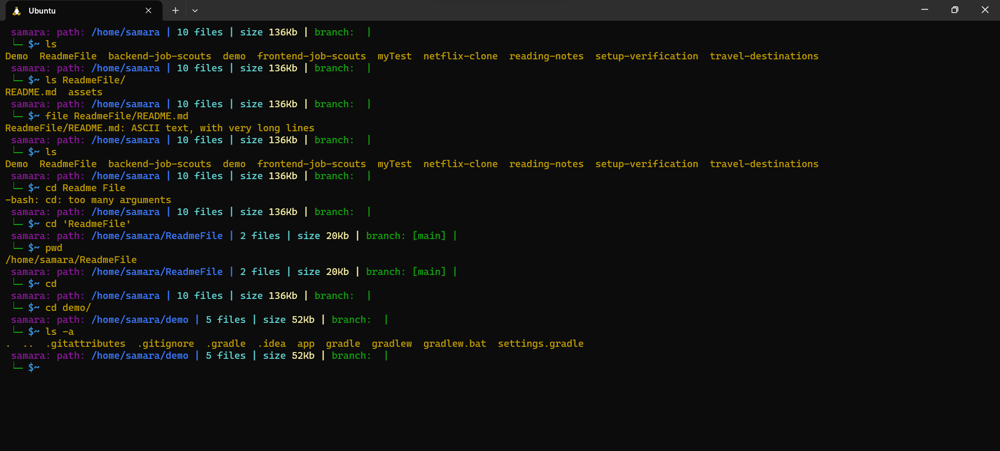
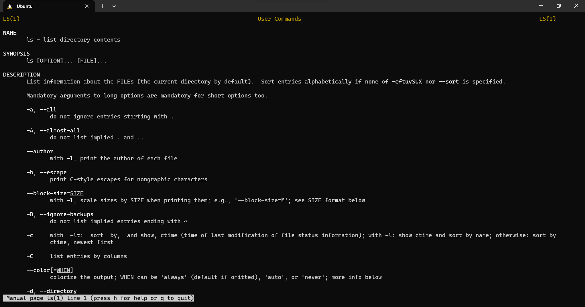
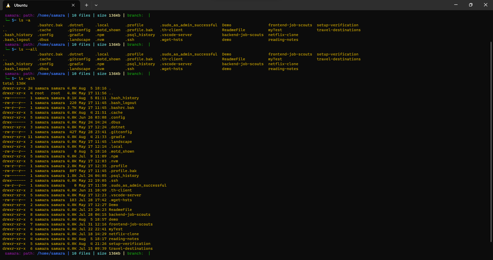
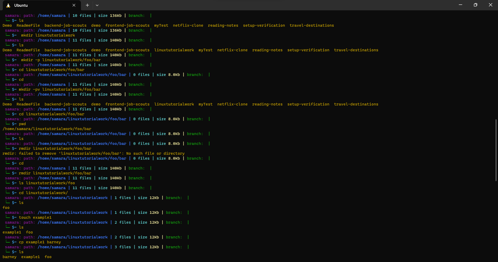
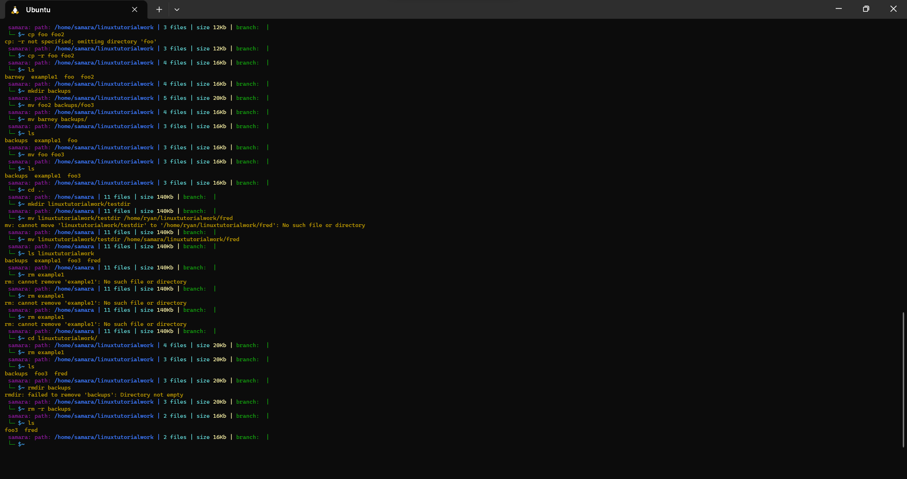

# Prep: Terminal

### ``Terminals``, also known as ``command lines`` or ``consoles``, allow us to accomplish and automate tasks on a computer without the use of a graphical user interface. Using a terminal allows us to send simple text commands to our computer to do things like navigate through a directory or copy a file, and form the basis for many more complex automations and programming skills.

---

# The Command Line!

### A ``command line``, or ``terminal``, is a text based interface to the system. You are able to enter commands by typing them on the keyboard and feedback will be given to you similarly as text.

## Here is an example:




* Line 1 presents us with a prompt  ``samara``. After that we entered a command ``ls``. Typically a command is always the first thing you type. After that we have what are referred to as command line arguments  ``ls -l /home/samara``. Important to note, these are separated by spaces ``there must be a space between the command and the first command line argument also``. The first command line argument ``-l``  is also referred to as an option. Options are typically used to modify the behaviour of the command. Options are usually listed before other arguments and typically start with a dash  ``-`` .

* Other Lines are output from running the command. Most commands produce output and it will be listed straight under the issuing of the command. Other commands just perform their task and don't display any information unless there was an error.

## The Shell, Bash

### Within a terminal you have what is known as a shell. This is a part of the operating system that defines how the terminal will behave and looks after running (or executing) commands for you. There are various shells available but the most common one is called bash which stands for Bourne again shell. This tutorial will assume you are using bash as your shell.

### If you would like to know which shell you are using you may use a command called echo to display a system variable stating your current shell. echo is a command which is used to display messages.

## Here is an example:



---

# Basic Navigation!

### The first command we are going to learn is ``pwd`` which stands for Print Working Directory.  The command does just that. It tells you what your current or present working directory is. Give it a try now.



* ``pwd`` just to verify where we currently are.

---

### It's one thing to know where we are. Next we'll want to know what is there. The command for this task is ``ls``. It's short for list. Let's give it a go.

### ls [options] [location]



---


* ``ls`` providing it with a relative path. Documents is a directory in our current location. This command could produce different results depending on where we are. If we had another user on the system, bob, and we ran the command when in their home directory then we would list the contents of their Documents directory instead.

* ls providing it with an absolute path. This command will provide the same output regardless of our current location when we run it.

---

``` 
cd [location] 
```

## Here is an example:



#### If you run the command cd without any arguments then it will always take you back to your home directory.


# Summary

```
pwd
Print Working Directory - ie. Where are we currently.

ls
List the contents of a directory.

cd
Change Directories - ie. move to another directory.

```
``` 
Relative path
A file or directory location relative to where we currently are in the file system.

Absolute path
A file or directory location in relation to the root of the file system.
```
---
# More About Files!

### Ok, the first thing we need to appreciate with linux is that under the hood, everything is actually a file. A text file is a file, a directory is a file, your keyboard is a file

## Here is an example:



## Linux is Case Sensitive

### This is very important and a common source of problems for people new to Linux. Other systems such as Windows are case insensitive when it comes to referring to files. Linux is not like this. As such it is possible to have two or more files and directories with the same name but letters of different case.

# Summary

```
file
obtain information about what type of file a file or directory is.

ls -a
List the contents of a directory, including hidden files.
```
---
```
Everything is a file under Linux
Even directories.

Linux is an extensionless system
Files can have any extension they like or none at all.

Linux is case sensitive
Beware of silly typos. 
```
---

# Manual Pages!

## The manual pages are a set of pages that explain every command available on your system including what they do, the specifics of how you run them and what command line arguments they accept.

``man <command to look up>``
---




---
## Let's break it down:

* Line 3 tells us the actual command followed by a simple one line description of it's function.
* Lines 6 is what's called the synopsis. This is really just a quick overview of how the command should be run. Square brackets ``[ ]`` indicate that something is optional. ``(option on this line refers to the command line options listed below the description)``
* Line 9 presents us with a more detailed description of the command.
* Line 11 onwards Below the description will always be a list of all the command line options that are available for the command.

``Tip: To exit the man pages press 'q' for quit.``

## Searching

### It is possible to do a keyword search on the Manual pages. This can be helpful if you're not quite sure of what command you may want to use but you know what you want to achieve. 

``` 
man -k <search term>
```

#### If you want to search within a manual page this is also possible. To do this, whilst you are in the particular manual page you would like to search press forward slash ``/`` followed by the term you would like to search for and hit ``enter`` If the term appears multiple times you may cycle through them by pressing the ``n`` button for next.

## More on the Running of Commands

### A lot of being proficient at Linux is knowing which command line options we should use to modify the behaviour of our commands to suit our needs. A lot of these have both a long hand and short hand version. eg. Above you will notice that to list all directory entries (including hidden files) we can use the option -a or --all (remember from last section what files and directories beginning with a . are?). The long hand is really just a more human readable form. You may use either, they both do the same thing. One advantage of using long hand is that it can be easier for you to remember what your commands are doing. One advantage of using shorthand is that you can chain multiple together easier.



# Summary

```
man <command>
Look up the manual page for a particular command.
man -k <search term>
Do a keyword search for all manual pages containing the given search term.
/<term>
Within a manual page, perform a search for 'term'
n
After performing a search within a manual page, select the next found item.

```
---
``The man pages are your friend.
Instead of trying to remember everything, instead remember you can easily look stuff up in the man pages.
``

---

# File Manipulation!

## We've got some basic foundation stuff out of the way. Now we can start to play around. To begin with we'll learn to make some files and directories and move them around. 
 
# Making a Directory

### Linux organises it's file system in a hierarchical way. Over time you'll tend to build up a fair amount of data . It's important that we create a directory structure that will help us organise that data in a manageable way. I've seen way too many people just dump everything directly at the base of their home directory and waste a lot of their time trying to find what they are after amongst 100's (or even 1000's) of other files. Develop the habit of organising your stuff into an elegant file structure now and you will thank yourself for years to come.

---

``mkdir [options] <Directory>
``
---

### In it's most basic form we can run mkdir supplying only a directory and it will create it for us.

### There are a few useful options available for ``mkdir``. Can you remember where we may go to find out the command line options a particular command supports?

### The first one is ``-p`` which tells ``mkdir`` to make parent directories as needed (demonstration of what that actually means below). The second one is ``-v`` which makes mkdir tell us what it is doing (as you saw in the example above, it normally does not).





## Copying a File or Directory

### There are many reasons why we may want to make a duplicate of a file or directory. Often before changing something, we may wish to create a duplicate so that if something goes wrong we can easily revert back to the original. The command we use for this is cp which stands for copy.

---

``cp [options] <source> <destination>``

---



---

# Summary

```
mkdir
Make Directory - ie. Create a directory.

rmdir
Remove Directory - ie. Delete a directory.

touch
Create a blank file.

cp
Copy - ie. Copy a file or directory.

mv
Move - ie. Move a file or directory (can also be used to rename).

rm
Remove - ie. Delete a file.

No undo
The Linux command line does not have an undo feature. Perform destructive actions carefully.

Command line options
Most commands have many useful command line options. Make sure you skim the man page for new commands so you are familiar with what they can do and what is available.
```